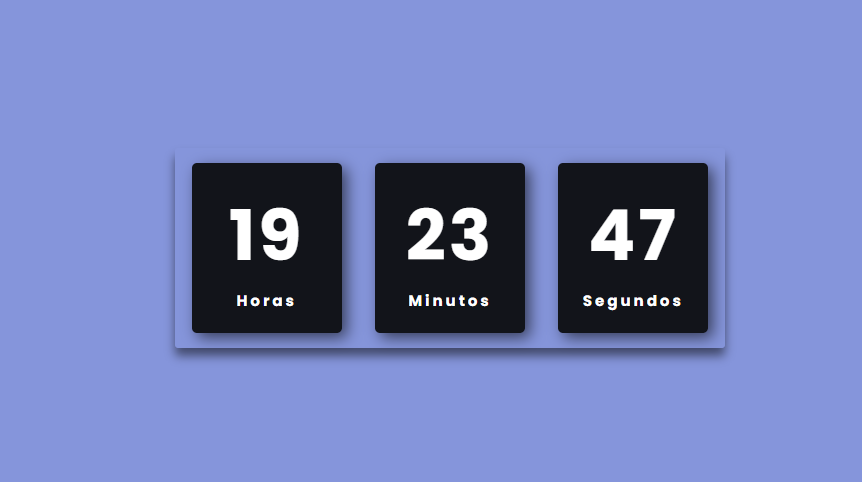

  

# Projeto de Relógio

  

Este é um projeto de relógio digital desenvolvido para praticar manipulações de datas e horários em JavaScript. O relógio exibe a hora atual, atualizando-se em tempo real, e inclui funcionalidades adicionais, como a exibição da data atual e opções de formato de hora.

  

  

## Funcionalidades

  

- Exibe a hora e a data atuais.

- Atualização em tempo real a cada segundo.

- Suporte para formatos de 12 e 24 horas.

- Interface simples e responsiva.

  

## Tecnologias Utilizadas

  

-  *JavaScript* para manipulação de datas e lógica do relógio.

-  *HTML e CSS* para a estrutura e estilo da interface.

  

## Como Usar

  

Clone o repositório e abra o arquivo index.html em um navegador para visualizar o relógio em funcionamento ou você pode ter acesso clicando neste link  [clique aqui para ter acesso](https://thainasantoss.github.io/smart-watch/)

  

## Aprendizados

  

Durante o desenvolvimento deste projeto, aprendi a trabalhar com objetos de data e hora em JavaScript, incluindo a formatação e manipulação de dados temporais.

